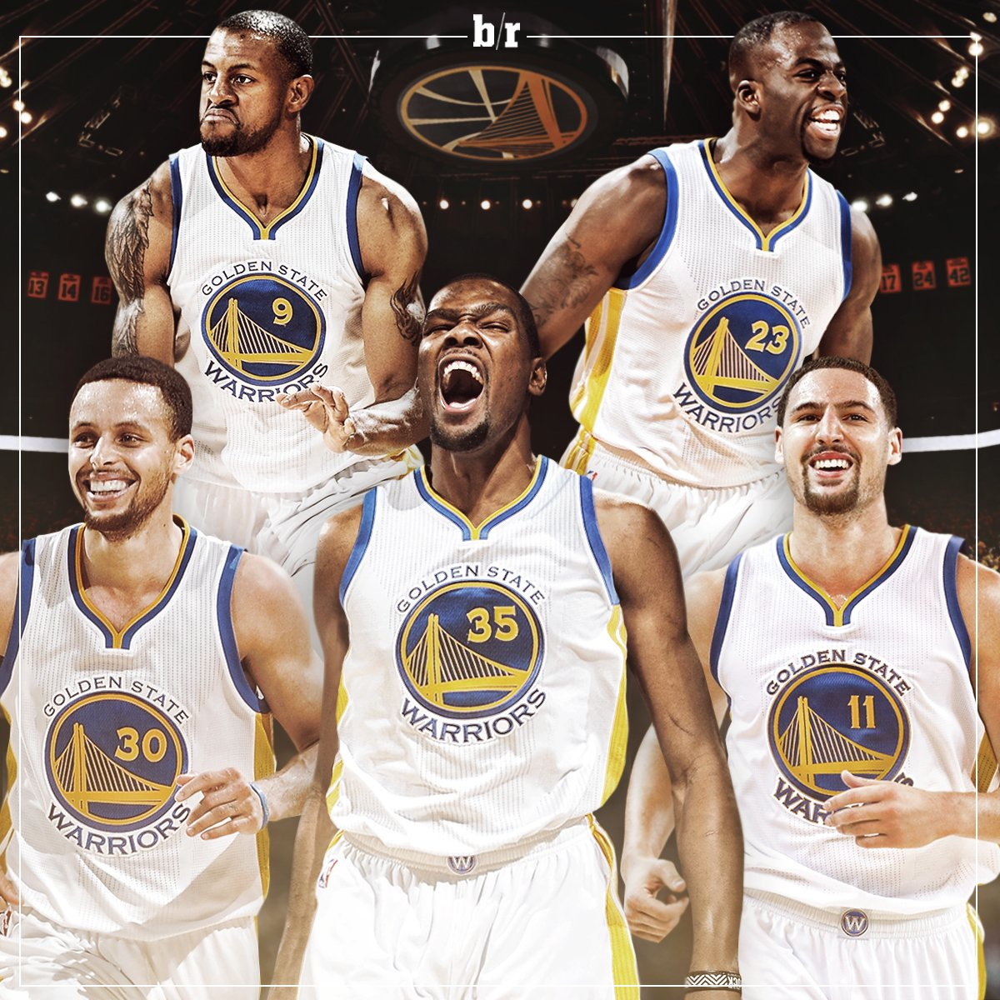
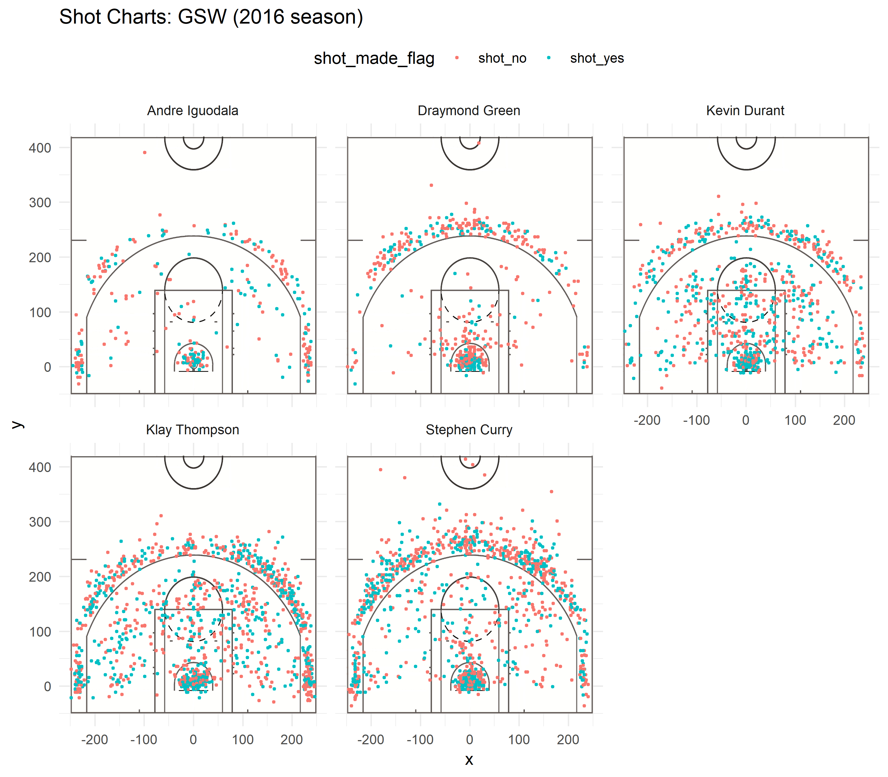

```{r setup, include=FALSE}
knitr::opts_chunk$set(echo = TRUE)
```

```{r include=FALSE}
library(dplyr)
```

```{r include=FALSE}
dat = read.csv("../data/shots-data.csv")
```


#The Future of the Warriors: Setting the Bar Higher

The Golden State Warriors are at it again this 2016 season. Shocking fans with a stunning performance, the Warriors are on a roll, and their dominance continues to live on. Taking a closer look at some of their players, how can they do better next year?

```{r out.width='80%', echo = FALSE, fig.align='center'}

```


###Motivation/Background
With such a great season, it is only natural to take a look at some of the reasons for their success, focusing mainly on five players: Stephen Curry, Kevin Durant, Draymond Green, Andre Iguodala, and Klay Thompson. More specifically, this analysis will be taking a look at some statistics on their shots, including 2-point field goals and 3-point field goals. From there, this analysis will determine what the team should do in the future to pump out even crazier statistics. Essentially, this analysis will determine who should be more focused on shooting.


###Data
We took shooting data on the five players collected throughout the season. This included the time the shot was attempted, whether it was a successful shot, the action type, the shot type, the shot distance, the opposing team, the game date, and the coordinates the shot was attempted. 


###Analysis & Discussion
To make comparisons among the players later, the five players' data were combined into one large data table. For each player, a shot chart was created. A faceted shot chart of each of the five players is shown below. Each point is an attempted shot at that position of the court, and the two colors represent whether the shot was successful or not. Blue is a successful shot while red is an unsuccessful shot. 

```{r out.width='80%', echo = FALSE, fig.align='center'}

```

One of the most blatant features of the charts is the differences in the number of shots each player attempts. Stephen Curry and Klay Thompson have attempted the greatest number of shots while Andre Iguodala and Draymond Green have attempted much fewer. This means throughout the season, Curry and Thompson are popular players to pass the ball to for shots. Is this the best way to play or should players pass more to Durant, Green, or Iguodala? In other words, __who should the Golden State Warriors prioritize passing the ball to shoot among these 5?__ 

Before answering that question, let us look at some of the other results from the faceted shot charts. Shots seem to have regions where they are clustered. For example, the region under the hoop is exceptionally dense, meaning a plethora of shots were attempted there given the small area. This makes sense since that region is the closest to the hoop, so it is much easier to score points there than any other place in the 2 point field goal region. Another region is the edge of the 3 point field goal region, which, again, makes sense since it is closest to the hoop for a 3 pointer, assuming the farther away from the hoop, the less likely it is to make a successful shot.

One more feature is that for some of these players, there are distinct regions where the player is better or worse at. Moving outwards, all players make fewer shots the farther out from the hoop they are. Green is less suited for making 2 point field goals unless he is under the hoop, and Durant is exceptionally well suited for being under the hoop. For the other players, the other trends and details are a little more subtle, but some effective shooting percentage tables can help us to identify more about these players. In turn, these tables can also help us answer the original question: Who should the Golden State Warriors prioritize passing the ball to shoot among these 5? Here are the tables generated from the players' data, including the code (the tables include the number of attempts, the number of successful shots, and the percentage of successful shots):

####2PT Effective Shooting % by Player
```{r}
g2 = group_by(filter(dat, shot_type == "2PT Field Goal"), name)
effective_shooting2 = summarise(g2, 
                                total = length(shot_made_flag), 
                                made = length(shot_made_flag[shot_made_flag == 'shot_yes']), 
                                perc_made = made / total)
effective_shooting2 = arrange(effective_shooting2, desc(perc_made))
effective_shooting2
```

####3PT Effective Shooting % by Player
```{r}
g3 = group_by(filter(dat, shot_type == "3PT Field Goal"), name)
effective_shooting3 = summarise(g3, 
                                total = length(shot_made_flag), 
                                made = length(shot_made_flag[shot_made_flag == 'shot_yes']), 
                                perc_made = made / total)
effective_shooting3 = arrange(effective_shooting3, desc(perc_made))
effective_shooting3
```

####Overall Effective Shooting % by Player
```{r}
g = group_by(dat, name)
effective_shooting = summarise(g, 
                               total = length(shot_made_flag), 
                               made = length(shot_made_flag[shot_made_flag == 'shot_yes']), 
                               perc_made = made / total)
effective_shooting = arrange(effective_shooting, desc(perc_made))
effective_shooting
```

From the tables, all five players were less accurate when shooting 3-point field goals, as noted by their lower percentages in the second table. This confirms the subtle pattern from the shot charts. In addition, Andre Iguodala, Klay Thompson, and Kevin Durant are the top shooters for 2-point field goals, 3-point field goals, and overall effective shooting respectively. Therefore, these are the people who the team should be prioritizing to pass the ball to for these situations. As second priority, Durant, Curry, and Iguodala should get the ball for 2-pointers, 3-pointers, and overall shooting respectively. However, one caveat is that Iguodala did not make as many shots as the others, so his statistics may not be representative of how he plays in the long run. Even so, while Curry and Thompson are good shooters, there are better alternatives to increase the number of points scored.


###Conclusions
There are several notable results from this analysis:

+ Stephen Curry and Klay Thompson are the most and second most frequent shooters among the five players respectively
+ Each player was more accurate when they were closer to the hoop
+ Players had "hotspots" of where they frequently shot such as under the hoop and along the border of the 3-point line
+ Andre Iguodala and Kevin Durant were the most and second most accurate 2-point shooters respectively
+ Klay Thompson and Stephen Curry were the most and second most accurate 3-point shooters respectively
+ Kevin Durant and Andre Iguodala were the most and second most accurate shooter overall respectively

So who should the Golden State Warriors prioritize passing the ball to shoot among these 5? The key takeaway is _Durant and Iguodala should be passed the ball to shoot in most situations overall. In more specific situations, Iguodala and Durant should be given the ball for 2 pointers; Thompson and Curry should be given the ball for 3 pointers_. However, the tricky part is that this analysis only looks at scoring. For instance, Iguodala and Green might not have shot as much because they are more well suited as support players or defense, and Curry may have lower accuracy because of the fatigue. Even so, the Golden State Warriors put a great show this season, but with a constantly evolving sport, playing to their strengths will ensure another stunning year.


###References

[Photograph of Stephen Curry, Kevin Durant, Andre Iguodala, Draymond Green, and Klay Thompson]. 2016. Photograph. B/R Football, https://pbs.twimg.com/media/CmiE3AOXEAEDBQ5.jpg.


